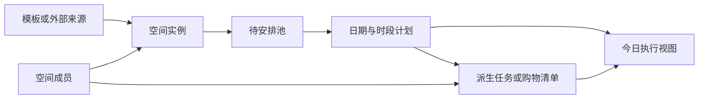

# 技术影响：旅行计划与家庭菜谱闭环

> 状态：源技术分析。旅行部分由 v1.0 聚合迭代统一收口，菜谱模型留待后续版本。

## 架构结论

沿用现有“生活空间 + 统一卡片 + 模板实例”架构，不为菜谱另建孤立应用。增加计划编排和派生关系两个通用能力。



## 领域模型增量

### 通用来源关系

为计划条目、任务和清单项增加：

```js
{
  sourceType: "travel_node" | "recipe" | "meal_plan" | "manual",
  sourceId: string | null,
  generated: boolean
}
```

派生项可以独立修改，但来源变更时只提示同步，不自动覆盖用户修改。

### 旅行地点池

新增 `travel_place_candidates`，或在旅行实例中增加 `candidatePlaces`。P0 建议放入旅行实例，避免新增集合：

```js
{
  id,
  name,
  address,
  latitude,
  longitude,
  category,
  notes,
  imageAttachmentIds,
  scheduledDayId: null
}
```

排入某天时生成或关联 `travel_plan_instances.days.nodes`。

### 菜谱与菜单

建议新增集合：

- `recipes`：空间内可编辑菜谱实例。
- `meal_plans`：按周或日期保存餐次安排。
- `shopping_lists`：共享采购清单。

核心结构：

```js
// recipes
{
  id, spaceId, title, servings,
  prepMinutes, cookMinutes,
  ingredients: [{ id, name, quantity, unit, note }],
  steps: [{ id, order, body, timerSeconds }],
  tags, sourceUrl, sourceSnapshot, attachmentIds,
  createdBy, createdAt, updatedAt, archivedAt
}

// meal_plans
{
  id, spaceId, startDate,
  entries: [{ id, date, mealType, recipeId, servings }],
  createdAt, updatedAt, archivedAt
}

// shopping_lists
{
  id, spaceId, mealPlanId,
  items: [{
    id, ingredientKey, displayName, quantity, unit,
    sourceRecipeIds, checked, checkedBy, generated
  }],
  createdAt, updatedAt, archivedAt
}
```

食材合并不能只拼字符串。P0 至少标准化名称、数量和单位；无法安全换算的食材分开显示并允许人工合并。

## 页面影响

- 旅行计划编辑器新增“待安排地点”和“每日行程”两个视图。
- 每日行程增加地图/时间线切换或上下联动。
- 生活模块增加菜谱库、待安排、周菜单、购物清单。
- 今日页按当前空间展示下一段行程、待采购项或当前餐次。
- 卡片详情继续承载任务、评论、意见和提醒；菜谱正文不塞进通用卡片。

## 云函数边界

建议新增：

- `upsertTravelCandidate`
- `scheduleTravelCandidate`
- `reorderTravelNodes`
- `upsertRecipe`
- `upsertMealPlan`
- `generateShoppingList`
- `updateShoppingItem`

所有写操作继续通过空间成员权限校验。购物清单生成应具备幂等键，避免重复点击产生重复项目。

## 数据迁移

- 现有东京模板节点保持兼容，缺失的新字段使用默认值。
- 当前生活卡片不自动转换成菜谱；只有明确标记为菜谱的卡片才迁移。
- 新增 schema 版本；本地预览状态升级时不得清空用户已有数据。

## 验证重点

- 候选地点排期后不产生重复节点。
- 地图和时间线引用同一节点 ID。
- 菜谱份量换算不修改原始食材数量。
- 多菜谱同名同单位食材能合并，不同单位不错误相加。
- 重新生成购物清单不会重复已有生成项，也不会删除手工项。
- 访客不能修改菜谱、菜单或购物清单。
