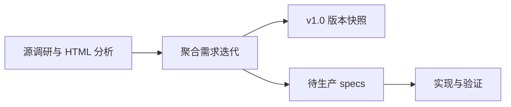

# v1.0 旅行需求迭代

## 状态

- 阶段：需求已聚合，spec 已生成，可进入 coding。
- 版本：v1.0。
- 主场景：用户浏览东京 8 天旅行模板，并在自己的旅行空间中创建、编辑和协作执行计划。
- 后续唯一需求输入：本目录的 `requirements.md`。
- Coding spec 入口：`docs/specs/v1.0/README.md`。

## 为什么聚合

前两轮分别解决了两个问题：

1. 成熟旅行产品有哪些可复用的规划闭环。
2. `关东东京8天旅行计划.html` 如何兼顾精美浏览和灵活编辑。

这两个问题属于同一个用户旅程，不应分别生产 spec。本迭代将它们合并为：

`发现模板 -> 浏览攻略 -> 使用计划 -> 协作编辑 -> 今日执行 -> 归档`

## 输入材料

- `docs/iterations/2026-07-01-travel-recipe-research/`
- `docs/iterations/2026-07-01-tokyo-html-v1/`
- `docs/versions/v1.0/travel-prd.md`
- `docs/versions/v1.0/travel-technical-design.md`
- `docs/versions/v1.0/tokyo-html-analysis.md`
- `docs/specs/vikisize-life-assistant-mvp.md`
- `docs/specs/vikisize-travel-space-technical-design.md`

## 本目录职责

- `requirements.md`：v1.0 旅行功能的最终需求边界与验收标准。
- `decisions.md`：范围取舍、优先级和关键设计决策。
- `spec-plan.md`：下一轮应生产哪些 spec、生产顺序和进入条件。

## 文档层级

发生冲突时按以下优先级处理：

1. 本目录的 `requirements.md`。
2. 本目录的 `decisions.md`。
3. `docs/versions/v1.0/`。
4. 两个源调研目录。

主 PRD 仍负责产品全局边界；本聚合迭代负责旅行 v1.0 的可执行范围。
