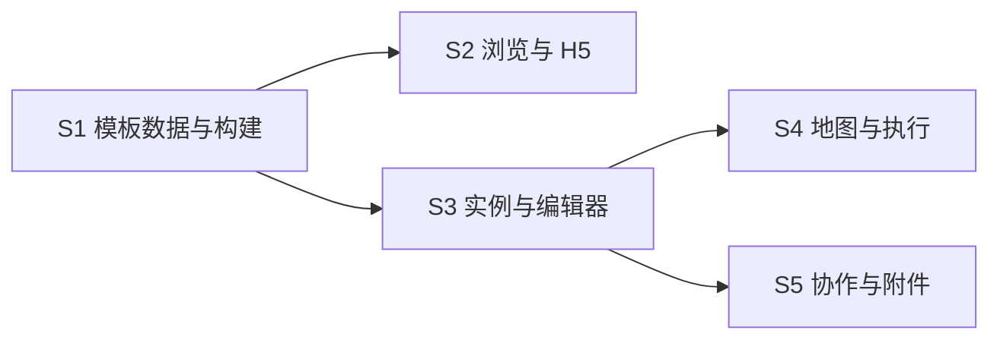

# v1.0 旅行 spec 生产计划

本文件定义 spec 的生产边界。S1-S5 已生成，当前入口为 `docs/specs/v1.0/README.md`。

## 生产状态

- S1：已生成。
- S2：已生成。
- S3：已生成。
- S4：已生成。
- S5：已生成。

## 进入条件

- `requirements.md` 被视为本版本唯一需求输入。
- `decisions.md` 中 D1-D8 没有待推翻项。
- v1.0 P0/P1/非目标边界已固定。
- 正式 H5 托管域名可以在 spec 中作为配置项，当前无需先确定最终域名。

## 建议 spec 集合

### S1：旅行模板数据与构建 Spec

范围：模板 JSON 契约、稳定 ID、schema 校验、从现有 HTML 迁移、H5 构建、小程序种子构建、版本策略。

依赖：无。应最先生产。

### S2：模板浏览与 H5 预览 Spec

范围：模板列表、`desc`、模板详情、`web-view`、加载失败降级、预览 URL 和业务域名配置。

依赖：S1 的模板元数据契约。

### S3：旅行实例与编辑器 Spec

范围：幂等实例创建、日期、节点、模块、候选地点池、排序、活动记录和归档。

依赖：S1 的模板正文契约。

### S4：地图与今日执行 Spec

范围：坐标约定、地图/时间线同源、点位联动、打开微信地图、今日节点和下一站。

依赖：S3 的节点模型。

### S5：旅行协作与附件 Spec

范围：管理员/成员/访客、敏感字段、图片、评论、意见、提醒、派生任务和来源追溯。

依赖：S3；复用现有空间权限和统一卡片模型。

## 生产顺序

S2 与 S3 可以在 S1 完成后并行。S4、S5 在 S3 模型稳定后生产。

## 每份 spec 必须包含

- 目标与非目标。
- 当前代码基线。
- 用户流程和状态。
- 数据契约与迁移。
- 页面、组件和云函数边界。
- 权限和失败处理。
- 可观察行为的验收标准。
- 自动化测试与真机验证计划。
- 分阶段实现任务。

## spec 完成门槛

- 不重新发明已存在的空间、成员、卡片和活动模型。
- 不让 H5 成为云端实例编辑的必要依赖。
- 每个 P0 需求至少映射到一份 spec 的验收标准。
- 不把 P1 或非目标偷偷放入 P0 实现任务。
