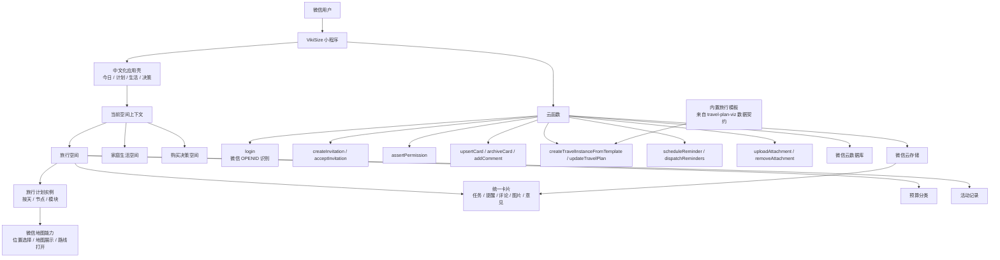
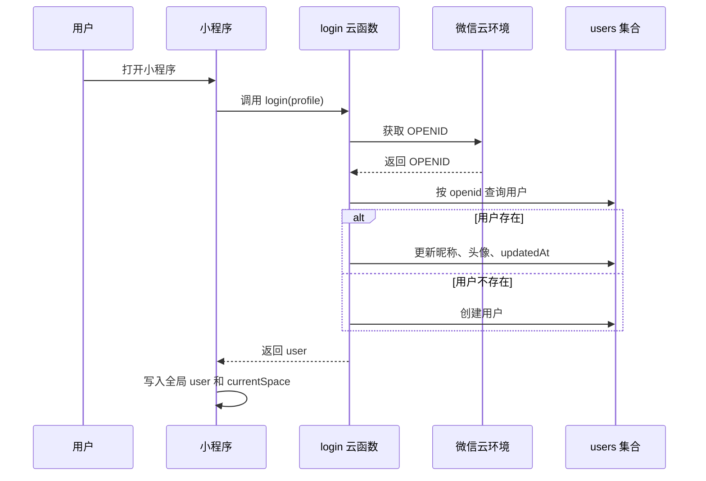
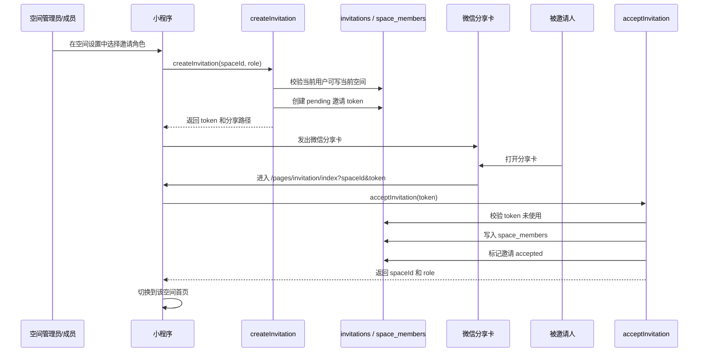
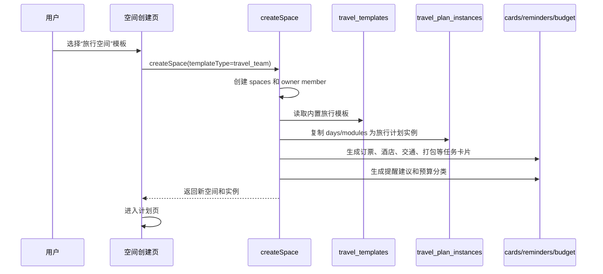
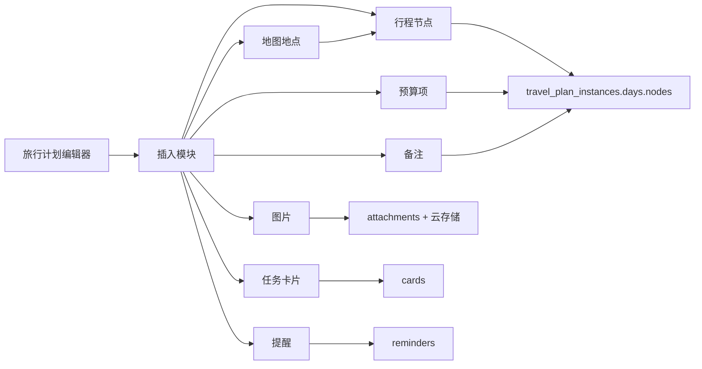

# VikiSize 旅行空间技术方案

## 目标

把当前小程序从“早期功能页面集合”收束成以生活空间为核心的协作应用。第一条完整链路是旅行空间：

1. 用户通过微信身份进入小程序。
2. 创建或进入一个旅行空间。
3. 从内置旅行模板生成可编辑的空间计划实例。
4. 空间成员按角色协作编辑计划、任务、预算、图片和地图位置。
5. 通过微信分享卡邀请成员加入指定空间。

本方案参考 `travel-plan-viz` 的旅行计划结构，但不直接把单文件 HTML 嵌入小程序。`travel-plan-viz` 更适合作为“旅行模板信息密度”和“旅行数据契约”的来源：每日时间线、地点、交通、订票提醒、图片、地图坐标、行前须知等字段应被结构化进入小程序数据层。

## 当前问题

- 页面里仍有英文展示：`Today`、`Plans`、`Life`、`Decisions`、`Travel Team MVP`、`Space Switcher`、`Shared Decisions`、`Itinerary`、`Tasks`、`Budget`、`Activity`、`Member`、`Guest` 等。
- 页面层级偏散：旅行页、计划页、空间页、设置页已经存在，但用户心智还没有完全统一到“当前空间”。
- 邀请链路已有本地版和云函数雏形，但还需要和前端分享入口、登录态、权限校验完整打通。
- 微信认证已有云函数基础：`login` 通过云环境拿 `OPENID` 并创建或更新用户；但当前页面主要仍跑本地 `localStore`，还不是完整生产认证链路。
- 旅行计划目前能按天展示和更新节点备注，但缺少模块化插入、图片附件、地图位置、地点坐标和更完整编辑表单。

## 产品信息架构

底部导航应中文化，并围绕当前空间组织：

- 今日：当前空间今天要做什么，待确认、提醒、今天行程、最近动态。
- 计划：旅行计划、共享任务、预算、归档。
- 生活：采购、家务、食谱、日常卡片。
- 决策：购买决策、候选方案、价格记录、成员意见。

非主导航页面：

- 空间：创建、切换、从模板创建。
- 空间设置：成员、角色、邀请、空间基础设置。
- 卡片详情：统一编辑任务、评论、图片、提醒、成员意见。
- 旅行计划：旅行空间内的 D1-DN 行程编辑器。
- 邀请确认：展示空间、邀请人、角色，确认加入。

## 整体架构图



## 核心系统链路

### 1. 登录与用户身份链路



当前代码已经具备 `login` 云函数和 `getOpenId/getOrCreateUser` 基础。后续要做的是让小程序启动、页面 `onShow` 和所有写操作都从云端用户态出发，而不是只依赖本地预览用户。

### 2. 邀请成员链路



当前已经有本地 `createInvitation/acceptInvitation` 和云函数版本。需要补强：

- 分享卡文案全中文：如“加入「关东东京 8 天旅行小队」”。
- 邀请角色中文化：管理员、成员、访客。
- token 加过期时间、状态和重复加入保护。
- 被邀请人打开后先走 `login`，再加入空间。
- 云函数要防止访客继续邀请他人。

### 3. 旅行模板到可编辑实例链路



模板是只读源；实例是空间内可编辑副本。这样一个旅行空间可以从东京模板开始，但后续由成员增删改，不影响原模板。

### 4. 模块化编辑链路

旅行计划不要只做“长文本编辑”，建议拆成可插入模块：

- 行程节点：时间、标题、地点、交通、预算、预约、备注、坐标。
- 图片模块：上传多图，关联到节点或卡片。
- 地图模块：地点选择、坐标、地图预览、打开路线。
- 任务模块：订票、酒店、餐厅、打包、证件、交通确认。
- 预算模块：预估、已确认、币种、分类。
- 提醒模块：提前天数、提醒时间、接收人。
- 备注模块：纯文本补充、行前须知、天气应对。



## 数据模型调整

保留现有集合边界，补充旅行编辑需要的字段。

### travel_plan_instances

```js
{
  id,
  spaceId,
  sourceTemplateId,
  sourceName,
  sourceVersion,
  initialSnapshot,
  days: [
    {
      id,
      date,
      weekday,
      theme,
      tip,
      nodes: [
        {
          id,
          type: "place" | "transport" | "meal" | "hotel" | "activity" | "note",
          period,
          time,
          title,
          location,
          address,
          latitude,
          longitude,
          route,
          booking,
          leadDays,
          estimatedCost,
          confirmedCost,
          imageAttachmentIds: [],
          linkedCardIds: [],
          notes
        }
      ]
    }
  ],
  budgetCategories,
  createdAt,
  updatedAt,
  archivedAt
}
```

### attachments

```js
{
  id,
  spaceId,
  cardId,
  travelInstanceId,
  dayId,
  nodeId,
  uploadedBy,
  cloudFileId,
  mimeType,
  width,
  height,
  createdAt
}
```

首版只支持图片，单节点或单卡片最多 9 张。图片存在微信云存储，数据库只存 `cloudFileId` 和关联关系。

### cards

继续作为计划、生活、决策三个模块的统一工作对象。旅行节点如果产生待办，例如“购买迪士尼门票”，应创建或关联一张 `plans` 卡片，而不是把任务逻辑写死在旅行节点里。

## 地图能力方案

小程序侧优先使用微信原生能力：

- `wx.chooseLocation`：编辑时选择地点，写入名称、地址、经纬度。
- `map` 组件：在旅行计划详情页展示当日地点集合。
- `wx.openLocation`：打开微信地图查看单个地点。
- `wx.getLocation`：可选，用于用户当前位置导航，不作为首版必须项。

当日地图展示建议：

- 顶部是一天的地图预览。
- 下方是时间线。
- 点击节点时地图高亮对应 marker。
- 节点未填坐标时展示“补充地点”按钮。

`travel-plan-viz` 使用 Leaflet CDN 和单文件 HTML 内联脚本；小程序里不应照搬 Leaflet，而是把它的 `initTravelMap` 思路迁移为小程序地图组件的数据适配层。

## 页面整理方案

### 中文化替换

建议建立统一中文标签表，避免页面里散落英文：

```js
const RoleLabels = {
  owner: "管理员",
  member: "成员",
  guest: "访客"
};

const ModuleLabels = {
  plans: "计划",
  life: "生活",
  decisions: "决策"
};

const TabLabels = {
  today: "今日",
  plans: "计划",
  life: "生活",
  decisions: "决策"
};
```

页面文案替换方向：

- `Today` -> `今日`
- `Plans` -> `计划`
- `Life` -> `生活`
- `Decisions` -> `决策`
- `Travel Team MVP` -> `旅行空间`
- `Space Switcher` -> `切换空间`
- `Members & Invite` -> `成员与邀请`
- `Itinerary` -> `行程`
- `Tasks` -> `任务`
- `Budget` -> `预算`
- `Activity` -> `动态`
- `Settings` -> `空间设置`
- `Member` -> `成员`
- `Guest` -> `访客`

### 页面收束

计划页应成为旅行空间的主入口，不再像功能 demo：

- 页面头部：当前空间名称、角色、切换空间、成员入口。
- 空间概览：今天行程、待确认、提醒。
- 分段视图：行程、任务、预算、动态。
- 行程入口：进入旅行计划编辑器。
- 卡片入口：统一进入卡片详情。

旅行计划页应成为“编辑器”：

- 顶部：行程名、当前日期、可写状态。
- 日期横向切换。
- 当日地图。
- 时间线节点。
- “插入模块”按钮。
- 节点编辑弹层：标题、时间、地点、地图、图片、预算、预约、备注。

## 权限策略

权限要同时在前端和云函数执行：

- 管理员：管理成员、邀请成员、编辑全部内容、归档空间。
- 成员：编辑计划、卡片、评论、图片、提醒和意见。
- 访客：只读，不能上传图片、编辑计划、评论、邀请、设置提醒。

所有写云函数必须调用权限校验。前端隐藏按钮只是体验优化，不能替代云函数校验。

## 接口边界

建议新增或补强这些云函数：

- `login(profile)`：微信身份解析，返回用户。
- `createSpace(templateType, name)`：创建空间；旅行模板同时创建实例。
- `createInvitation(spaceId, role, expiresAt)`：创建邀请。
- `acceptInvitation(token)`：接受邀请并加入空间。
- `getCurrentSpace(spaceId)`：读取空间首页聚合数据。
- `updateTravelNode(instanceId, dayId, nodeId, patch)`：编辑节点。
- `insertTravelModule(instanceId, dayId, module)`：插入行程节点、备注、任务、预算等模块。
- `removeTravelModule(instanceId, dayId, nodeId)`：删除模块。
- `uploadAttachment(spaceId, scope, tempFilePath)`：上传图片并写附件记录。
- `removeAttachment(attachmentId)`：删除附件记录，必要时删除云存储文件。
- `upsertCard(card)`：统一卡片创建和编辑。
- `scheduleReminder(cardId, type, scheduledAt)`：创建提醒。
- `dispatchReminders()`：定时发送订阅消息。

## 实施阶段

### 第一阶段：中文化与页面收束

- 底部导航改为 `今日 / 计划 / 生活 / 决策`。
- 替换页面内英文展示。
- 统一角色、模块、状态中文标签。
- 计划页整理为旅行空间主入口。

验收：

- 用户不再看到主要英文标签。
- 当前空间、当前角色、空间切换、成员入口清晰。

### 第二阶段：微信身份与邀请打通

- 小程序启动时调用 `login`。
- 页面状态从真实 `user` 和 `space_members` 获取。
- 邀请分享卡接入云函数。
- 邀请确认页先登录，再接受邀请。

验收：

- A 用户创建旅行空间并邀请 B。
- B 通过微信分享卡进入指定空间。
- B 的角色和权限正确。

### 第三阶段：旅行计划编辑器

- 支持新增、编辑、删除行程节点。
- 支持插入任务、预算、备注模块。
- 节点编辑产生活动记录。
- 访客只读。

验收：

- 成员可以修改某天行程。
- 修改后今日页、计划页、动态页同步展示。
- 访客点击编辑时得到中文提示。

### 第四阶段：图片附件

- 卡片和旅行节点支持上传图片。
- 图片写入云存储和 `attachments` 集合。
- 限制每个节点或卡片最多 9 张。
- 支持预览和删除。

验收：

- 成员能给某个景点节点添加图片。
- 图片在节点详情和卡片详情展示。
- 访客不能上传或删除图片。

### 第五阶段：地图能力

- 节点支持选择地点和经纬度。
- 当日行程展示地图 marker。
- 点击 marker 和时间线节点联动。
- 支持打开微信地图。

验收：

- 每天行程能在地图上查看地点。
- 编辑节点可补充或修改地点。

## 和 travel-plan-viz 的关系

`travel-plan-viz` 的定位是静态旅行页生成器，特点是：

- 单文件 HTML。
- 交互地图。
- 每日时间线。
- 订票提醒。
- 行前须知、交通、餐饮、图片、评分等补全信息。

VikiSize 应吸收这些能力，但变成可协作数据：

- `trip.days` -> `travel_plan_instances.days`
- 时间线卡片 -> 行程节点模块
- `needsBooking/leadDays` -> 提醒建议和任务卡片
- 图片 URL -> 图片附件或模板图片字段
- Leaflet 地图 -> 微信 `map` 组件
- 单文件静态展示 -> 云端模板 + 空间实例 + 成员编辑

## 风险与取舍

- 不做实时协同编辑；用保存后刷新和活动记录即可。
- 不做机票、酒店实时价格；只存用户手动确认的预算和备注。
- 不做复杂地图路线规划；首版只做地点选择、地图展示、打开位置。
- 不做模板自动更新实例；模板只用于创建初始副本。
- 不做多语言；首版全部中文。

## 建议的下一步

先做第一阶段和第二阶段，因为它们会清理当前体验最明显的问题，并验证空间、身份、邀请这条主链路。之后再做旅行计划编辑器、图片和地图，否则页面会继续像多个功能 demo 拼在一起。
