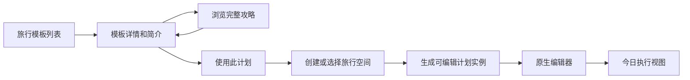

# VikiSize v1.0 旅行功能 PRD

## 问题

当前东京旅行计划有两种割裂体验：

- HTML 信息丰富、美观，但只能只读浏览，勾选状态也不能跨设备或成员同步。
- 小程序已有旅行实例和按天页面，但信息较少、编辑能力很弱，不能完整承接 HTML 计划。

v1.0 要让用户先被精美计划吸引和理解，再无损地把它变成自己空间内可调整、可协作的旅行计划。

## 用户流程

## 1. 旅行模板列表

每张模板卡必须包含：

- 封面图。
- 标题：关东东京 8 天旅行计划。
- `desc`：给两个人安排的东京进出方案，覆盖市区经典、台场夜景、镰仓海边、箱根温泉与迪士尼海洋；户外尽量安排在上午和傍晚。
- 天数、目的地、出发月份、适合人群和主要标签。
- 状态：官方模板、已创建实例或已归档。
- 操作：`浏览攻略`、`使用此计划`；已有实例时显示 `继续编辑`。

模板列表不直接展示整个 HTML，避免列表加载重、滚动卡顿和操作入口不清晰。

## 2. 模板详情

模板详情是进入 H5 前的原生小程序过渡页：

- 封面和简介。
- 路线摘要：东京市区、镰仓、箱根、迪士尼。
- 8 天主题概览。
- 预算参考、预约数量、地点数量。
- 更新时间和信息免责声明。
- 主按钮：`使用此计划`。
- 次按钮：`浏览完整攻略`。

## 3. HTML 完整攻略预览

- 使用独立 `web-view` 页面加载 HTTPS 地址。
- 保留当前 HTML 的封面、待办、行前须知、航班酒店、地图、时间线、餐饮、替代方案和贴士。
- H5 是只读展示；不直接写入空间实例。
- H5 页内提供“返回小程序使用此计划”的入口时，只传递模板 ID，不传递整份旅行数据或敏感 token。
- H5 加载失败时，原生模板详情仍可用，并显示重试与“直接使用此计划”。

## 4. 使用计划和实例创建

- 未登录用户先完成微信身份解析。
- 用户选择已有旅行空间或新建空间。
- 服务端根据 `templateId + templateVersion` 创建旅行实例。
- 创建是幂等的；同一空间重复点击不产生多个实例。
- 模板只读，实例可编辑，实例保留初始快照。

## 5. 原生旅行计划编辑

管理员和成员可：

- 修改旅行名称、日期、每日主题和说明。
- 新增、编辑、删除、复制和排序行程节点。
- 修改时间、停留时长、地点、坐标、交通、预算、预约、备注和图片。
- 增加餐饮、住宿、航班、活动、自由备注和备选方案模块。
- 从节点生成任务、提醒和待确认项。
- 查看地图与时间线，两者引用同一节点。

访客只能浏览，不可修改、上传、评论或创建提醒。

## 6. 执行视图

旅行开始后，今日页优先显示：

- 当前行程和下一站。
- 开始时间、地址、交通方式和打开地图。
- 相关票据图片和预约状态。
- 今日待确认、天气提示和备选方案。

编辑控件默认收起，避免出行时信息噪声。

## 7. 数据与隐私

- 确认号、证件信息和内部预算不应出现在公开 H5 模板。
- 访客默认看不到实例中的敏感确认字段。
- 外部图片、价格、营业时间和评分必须显示更新时间与免责声明。

## 验收标准

- 旅行模板列表能显示封面、简介和两个明确操作。
- 用户能从模板详情打开当前精美 HTML，并正常返回小程序。
- H5 不可用时仍能创建实例。
- 使用模板后生成独立实例，修改实例不影响模板和其他空间。
- 管理员和成员能增删改排旅行节点，访客不能修改。
- 地图和时间线显示相同节点和顺序。
- HTML、模板详情和新实例都显示相同模板版本。
