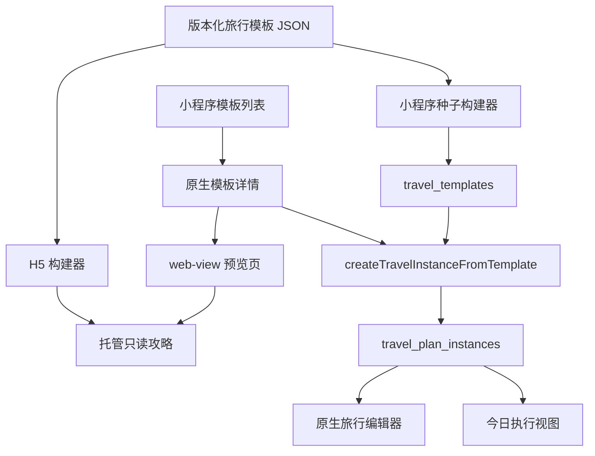

# VikiSize v1.0 旅行功能技术方案

## 方案比较

### 方案 A：只用 `web-view` 承载 HTML

优点：最快保留现有美观页面。

缺点：编辑、权限、云存储、活动记录、地图联动和弱网体验都变复杂；H5 与小程序通信不适合作为核心数据写入链路。

结论：只适合只读预览，不适合完整旅行功能。

### 方案 B：全部改成小程序原生页面

优点：编辑和微信能力最顺，状态与权限统一。

缺点：需要重新实现整套视觉展示，短期会损失当前 HTML 的完成度；HTML 公开分享价值也会消失。

结论：适合编辑器，但不必放弃 H5 预览。

### 方案 C：H5 预览 + 原生编辑器 + 单一模板数据源

优点：同时保留展示质量和原生编辑能力，职责清晰，后续可扩展更多旅行模板。

缺点：需要增加模板构建流程和两个渲染器。

结论：v1.0 推荐方案。

## 总体架构



## 单一数据源

不要继续让 HTML 内的 `trip` 和 `tokyoTravelTemplate.js` 各自维护旅行内容。

建议新增：

```text
apps/wechat-miniprogram/data/travel-templates/
  tokyo-8d.v1.json
scripts/travel-templates/
  build-h5.js
  build-miniprogram-seed.js
```

模板元数据：

```js
{
  id: "tokyo-kanto-8d",
  version: "1.0.0",
  title: "关东东京 8 天旅行计划",
  desc: "给两个人安排的东京进出方案……",
  coverImageUrl,
  destinationLabels: ["东京", "镰仓", "箱根"],
  durationDays: 8,
  audienceLabels: ["双人", "首次东京", "轻松节奏"],
  previewUrl,
  updatedAt,
  content: { preTrip, flights, hotelAreas, reminders, days, tips, disclaimer }
}
```

H5 和小程序种子都由该 JSON 生成。构建时校验必填字段、节点 ID、日期顺序、坐标和图片 URL。

## 页面与路由

建议新增：

```text
pages/travel-templates/index       模板列表
pages/travel-template-detail/index 原生模板详情
pages/travel-preview/index         仅包含 web-view
pages/travel-editor/index          原生编辑器
pages/travel-node-editor/index     节点编辑
```

`travel-preview` 示例：

```xml
<web-view src="{{previewUrl}}" bindmessage="onMessage" />
```

正式环境的 `previewUrl` 必须是 HTTPS，并在小程序后台完成业务域名配置和所有权校验。`web-view` 会独占页面，因此“使用此计划”主操作应放在原生详情页，不依赖悬浮在 H5 上的小程序按钮。

## 托管方案

### 当前 GitHub Pages

- `https://qddse.github.io/VikiSize/` 在 2026-07-01 验证返回 200，可作为浏览器公开预览。
- 中文文件名路径返回 404。
- 项目 Pages 位于 `qddse.github.io/VikiSize/` 子路径；微信业务域名校验通常要求能在域名根目录放置校验文件，因此正式 `web-view` 接入前必须实测，不能默认可用。

### 推荐生产托管

使用可以控制域名根目录的 HTTPS 托管：

- 自有域名静态站点；或
- 腾讯云/微信云托管静态资源。

要求：稳定 HTTPS、自有域名校验、缓存控制、版本化 URL、回滚能力和外部资源域名检查。

建议预览 URL：

```text
https://travel.example.com/templates/tokyo-kanto-8d/1.0.0/
```

## 编辑与同步

- H5 只读取模板版本，不读取空间实例。
- 小程序编辑器只读写 `travel_plan_instances`。
- 创建实例时记录 `sourceTemplateId`、`sourceVersion`、`initialSnapshot`。
- 实例编辑后不回写模板，也不重建公共 H5。
- 模板升级只影响新实例；现有实例不自动覆盖。

## 云函数

补充或加强：

- `listTravelTemplates`：返回列表所需元数据，不返回整个模板正文。
- `getTravelTemplate`：返回详情和版本。
- `createTravelInstanceFromTemplate`：幂等创建实例。
- `upsertTravelNode`：新增或编辑节点。
- `reorderTravelNodes`：批量更新单日排序。
- `removeTravelNode`：删除节点并记录活动。
- `upsertTravelModule`：餐饮、住宿、航班、备注和备选方案。

所有实例写操作必须验证空间角色。模板读取可以公开，但模板中不能包含空间成员数据和敏感字段。

## 地图

- H5 保留 Leaflet，只用于公共攻略浏览。
- 原生编辑器使用小程序地图组件和微信位置能力。
- 模板节点统一保存 WGS84 或明确声明的坐标系；写入小程序地图前集中转换，禁止页面各自转换。
- 时间线与地图使用相同 `nodeId` 和排序。

## 迁移步骤

1. 从 HTML 提取完整 `trip` 为 `tokyo-8d.v1.json`。
2. 为每一天和节点补稳定 ID。
3. 合并当前 `tokyoTravelTemplate.js` 中已有任务、预算和提醒类型。
4. 用 JSON 重新生成 H5，做像素和内容对比。
5. 小程序模板列表改读元数据。
6. 增加原生模板详情和 `web-view` 预览页。
7. 扩展实例模型和原生编辑器。
8. 配置并真机验证业务域名。

## 测试

- 模板 JSON schema 校验。
- H5 构建结果包含全部 8 天、提醒、地图点和章节。
- 列表接口不返回 43KB 全量正文。
- 预览 URL 可用、失败时原生页面可降级。
- 同一空间重复创建实例保持幂等。
- 修改实例不影响模板 JSON 和公共 H5。
- 管理员/成员写入成功，访客写入失败。
- 地图和时间线节点数、ID、顺序一致。
- iOS、Android 真机验证 `web-view`、返回导航和外部图片。
